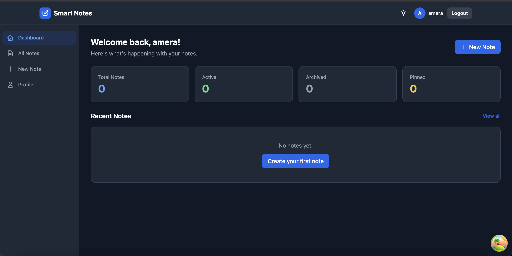

# Smart Notes Workspace

A full-stack note-taking application built with React and Node.js. Organize your thoughts with categories, tags, markdown support, and a clean dark/light interface.


---



---

## Features

- **Authentication** — Register and login with JWT. Sessions persist across page refreshes.
- **Full CRUD** — Create, view, edit, and delete notes with confirmation dialogs.
- **Rich Notes** — Categories, tags, pin notes to the top, archive notes.
- **Markdown** — Write in Markdown; toggle between rendered and raw view.
- **Search** — Debounced full-text search across title, content, and tags.
- **Filter & Sort** — Filter by category and status. Sort by date created, date updated, or title.
- **Pagination** — Navigate large note collections with smart page controls.
- **Optimistic UI** — Delete and pin actions update instantly without waiting for the server.
- **Profile** — Update your name, upload a profile avatar, and change your password.
- **Dark / Light theme** — Toggle persists across sessions.
- **Responsive** — Works on mobile, tablet, and desktop.
- **Swagger Docs** — Interactive API documentation at `/api-docs`.

---

## Tech Stack

**Frontend**
- React 18, React Router v6
- TanStack Query v5 (server state + caching)
- Redux Toolkit (auth + theme)
- React Hook Form + Zod (forms + validation)
- Axios (HTTP + interceptors)
- Tailwind CSS (styling + dark mode)
- react-markdown (Markdown rendering)
- Vite (build tool)

**Backend**
- Node.js, Express.js
- MongoDB + Mongoose
- JWT authentication, bcryptjs
- express-validator, Multer
- Swagger (swagger-jsdoc + swagger-ui-express)

---

## Project Structure

```
smart-notes-workspace/
├── backend/
│   ├── src/
│   │   ├── app.js
│   │   ├── controllers/
│   │   │   ├── authController.js
│   │   │   └── noteController.js
│   │   ├── middleware/
│   │   │   ├── auth.js
│   │   │   └── validate.js
│   │   ├── models/
│   │   │   ├── User.js
│   │   │   └── Note.js
│   │   ├── routes/
│   │   │   ├── auth.js
│   │   │   └── notes.js
│   │   └── utils/
│   │       ├── db.js
│   │       └── swagger.js
│   ├── uploads/
│   ├── .env.example
│   └── package.json
├── frontend/
│   ├── src/
│   │   ├── components/
│   │   │   ├── ui/
│   │   │   │   ├── Modal.jsx
│   │   │   │   └── Spinner.jsx
│   │   │   ├── Layout.jsx
│   │   │   ├── Navbar.jsx
│   │   │   ├── Sidebar.jsx
│   │   │   ├── NoteCard.jsx
│   │   │   ├── NoteForm.jsx
│   │   │   └── ProtectedRoute.jsx
│   │   ├── hooks/
│   │   │   └── useDebounce.js
│   │   ├── pages/
│   │   │   ├── Login.jsx
│   │   │   ├── Register.jsx
│   │   │   ├── Dashboard.jsx
│   │   │   ├── NotesList.jsx
│   │   │   ├── NoteDetails.jsx
│   │   │   ├── CreateNote.jsx
│   │   │   ├── EditNote.jsx
│   │   │   ├── Profile.jsx
│   │   │   └── NotFound.jsx
│   │   ├── services/
│   │   │   ├── api.js
│   │   │   ├── authService.js
│   │   │   └── noteService.js
│   │   ├── store/
│   │   │   ├── index.js
│   │   │   └── slices/
│   │   │       ├── authSlice.js
│   │   │       └── themeSlice.js
│   │   ├── App.jsx
│   │   ├── main.jsx
│   │   └── index.css
│   ├── index.html
│   └── package.json
├── DOCUMENTATION.md
└── README.md
```

---

## Getting Started

### Prerequisites

- Node.js v18+
- MongoDB (local install or [MongoDB Atlas](https://www.mongodb.com/atlas))

### 1. Clone the repository

```bash
git clone https://github.com/AmiraElsa3id/smart-notes-workspace.git
cd smart-notes-workspace
```

### 2. Set up the backend

```bash
cd backend
npm install
cp .env.example .env
```

Edit `.env`:

```env
PORT=5001
MONGO_URI=mongodb://127.0.0.1:27017/smart-notes
JWT_SECRET=replace_with_a_long_random_secret
JWT_EXPIRES_IN=7d
NODE_ENV=development
```

### 3. Set up the frontend

```bash
cd ../frontend
npm install
```

### 4. Run locally

Open two terminals:

```bash
# Terminal 1 — Backend
cd backend && npm run dev

# Terminal 2 — Frontend
cd frontend && npm run dev
```

| Service      | URL                          |
|--------------|------------------------------|
| Frontend     | http://localhost:5173         |
| Backend API  | http://localhost:5001         |
| Swagger Docs | http://localhost:5001/api-docs |

---

## API Endpoints

### Auth

| Method | Endpoint               | Auth | Description              |
|--------|------------------------|------|--------------------------|
| POST   | `/auth/register`       | No   | Create a new account     |
| POST   | `/auth/login`          | No   | Login and receive JWT    |
| GET    | `/auth/me`             | Yes  | Get current user profile |
| PATCH  | `/auth/me`             | Yes  | Update name / avatar     |
| PATCH  | `/auth/change-password`| Yes  | Change password          |

### Notes

| Method | Endpoint    | Auth | Description                              |
|--------|-------------|------|------------------------------------------|
| GET    | `/notes`    | Yes  | List notes (search, filter, sort, paginate) |
| GET    | `/notes/:id`| Yes  | Get a single note                        |
| POST   | `/notes`    | Yes  | Create a note                            |
| PATCH  | `/notes/:id`| Yes  | Update a note                            |
| DELETE | `/notes/:id`| Yes  | Delete a note                            |

**GET /notes query parameters:**

| Param    | Description                                              |
|----------|----------------------------------------------------------|
| `search` | Full-text search (title, content, tags)                  |
| `category`| `personal` / `work` / `study` / `health` / `finance` / `other` |
| `status` | `active` / `archived`                                    |
| `sortBy` | `createdAt` / `updatedAt` / `title`                      |
| `order`  | `asc` / `desc`                                           |
| `page`   | Page number (default: 1)                                 |
| `limit`  | Items per page (default: 10)                             |

---

## Environment Variables

### Backend `.env`

| Variable        | Required | Description                                      |
|-----------------|----------|--------------------------------------------------|
| `PORT`          | Yes      | Server port (default: 5001)                      |
| `MONGO_URI`     | Yes      | MongoDB connection string                        |
| `JWT_SECRET`    | Yes      | Secret key for signing JWTs (long random string) |
| `JWT_EXPIRES_IN`| Yes      | Token lifetime (e.g. `7d`, `24h`)                |
| `NODE_ENV`      | No       | `development` or `production`                    |

### Frontend `.env`

| Variable       | Required | Description          |
|----------------|----------|----------------------|
| `VITE_API_URL` | Yes      | Backend URL          |

---

## License

MIT
